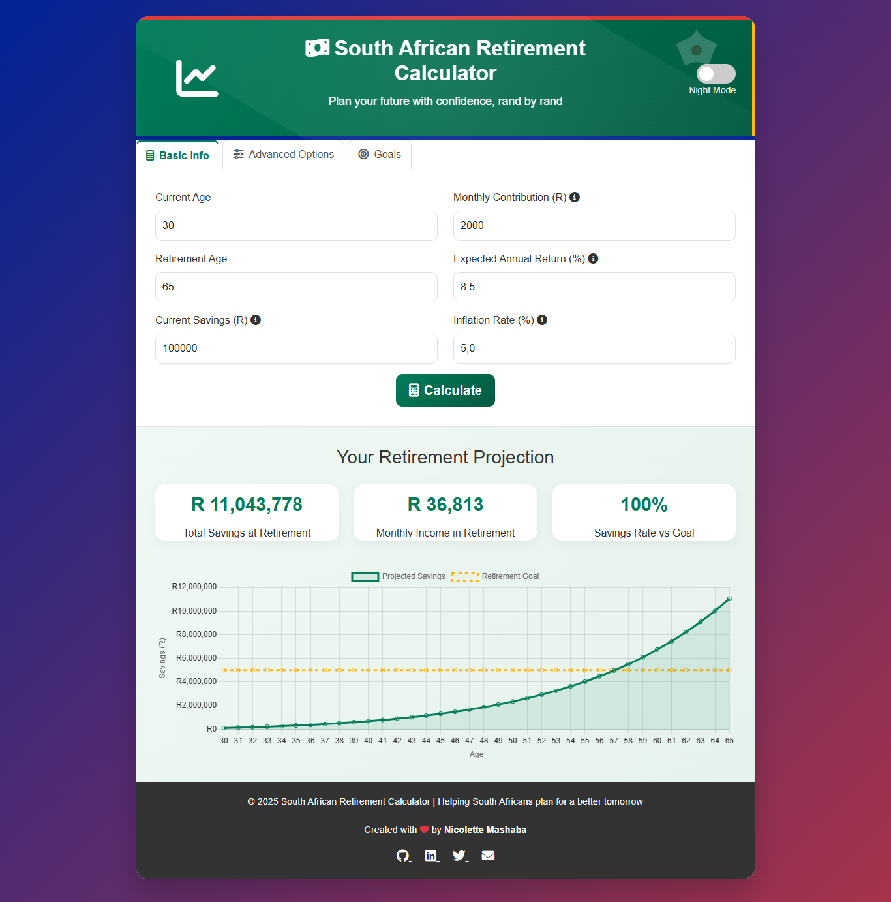

# South African Retirement Savings Calculator 💰

 (darkmode.png) <!-- Add a screenshot or GIF of your project here -->

A beautifully designed retirement savings calculator tailored for South Africans. Plan your financial future with precision, featuring dynamic projections, dark mode, and a user-friendly interface.

## Features ✨
- **Dynamic Projections**: Visualize your retirement savings growth over time.
- **Customizable Inputs**: Adjust contributions, returns, inflation, and more.
- **Dark Mode**: Eye-friendly dark theme for late-night planning.
- **South African Theme**: Inspired by the South African flag and culture.
- **Interactive Charts**: Built with Chart.js for clear, interactive data visualization.
- **Responsive Design**: Works seamlessly on desktop, tablet, and mobile.

## How It Works 🛠️
1. Enter your current age, retirement age, and savings details.
2. Adjust advanced options like salary growth, tax rates, and investment strategy.
3. Set your retirement goals and see if you're on track.
4. View detailed projections and monthly income estimates.

## Technologies Used 💻
- **HTML5**: Structure and content.
- **CSS3**: Styling and animations.
- **JavaScript**: Logic and interactivity.
- **Chart.js**: Data visualization.
- **Bootstrap 5**: Responsive design and UI components.
- **Font Awesome**: Icons.

## Installation 🚀
1. Clone the repository:
   ```bash
   git clone https://github.com/NickiMash17/ZA_Retirement_Calculator.git
   ```
2. Open ```index.html``` in your browser.  

## Live Demo 🌐
Check out the live demo [here](https://za-retirement-calculator.vercel.app/).

## Contributing 🤝
Contributions are welcome! Please open an issue or submit a pull request.

## License 📜
This project is licensed under the MIT License. See [LICENSE](LICENSE) for details.

---

Crafted with ❤️ by **[Nicolette Mashaba](https://github.com/NickiMash17)**  
[](https://github.com/NickiMash17)  
[](https://www.linkedin.com/in/nicolette-mashaba-b094a5221/)  
[](https://twitter.com/m_neyi)